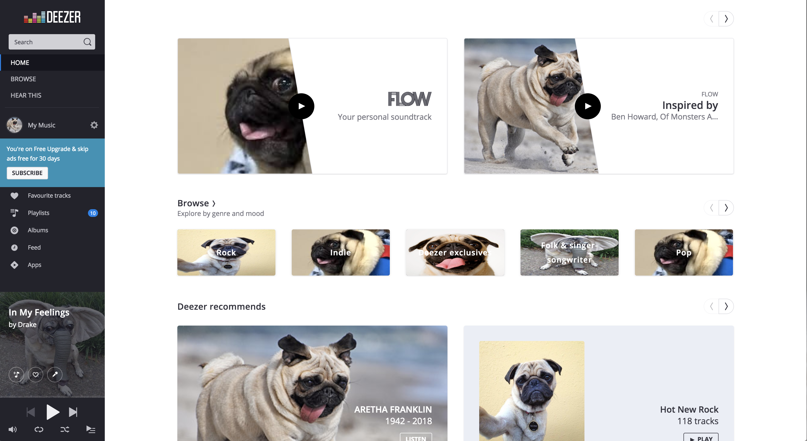

# puglife

> Chrome extension to replace images on page with pictures of pugs.

    

## Install

Follow the instructions [here](https://a9t9.com/howto/install-chrome-extension-from-file).

## License

MIT